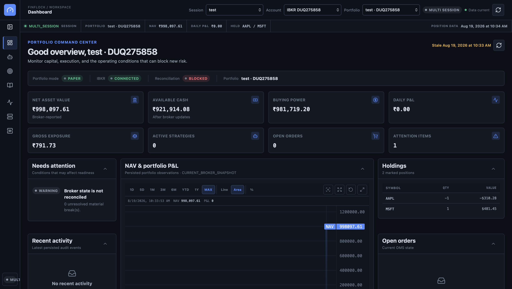
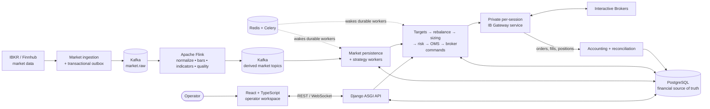
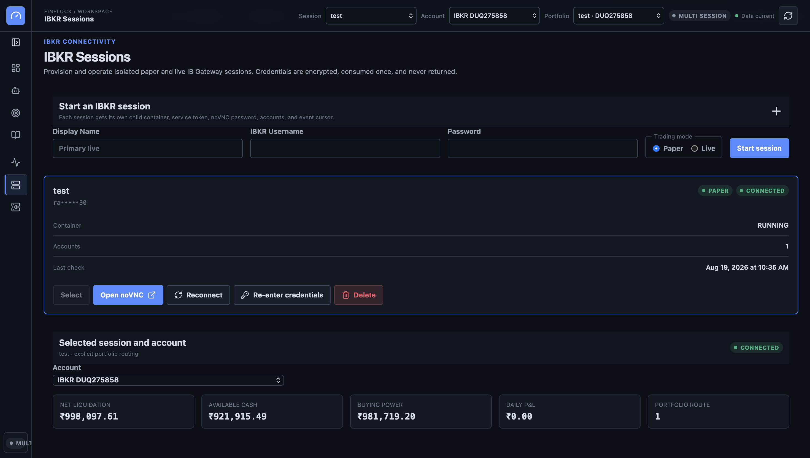
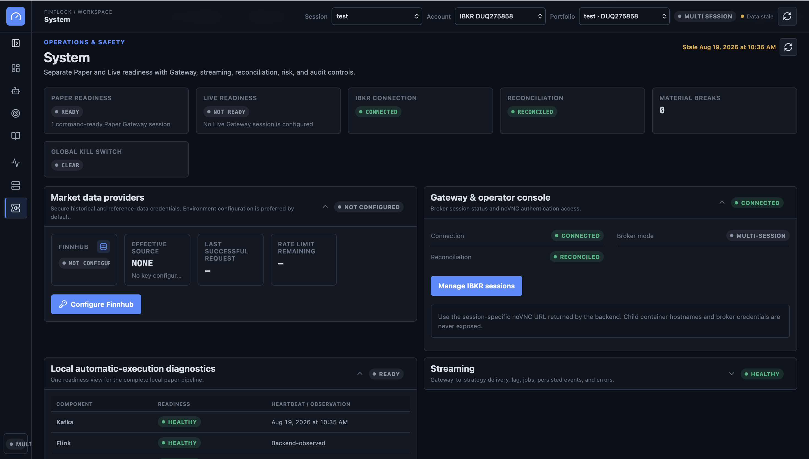
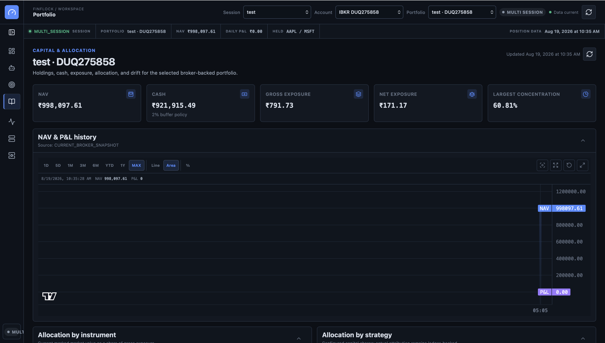
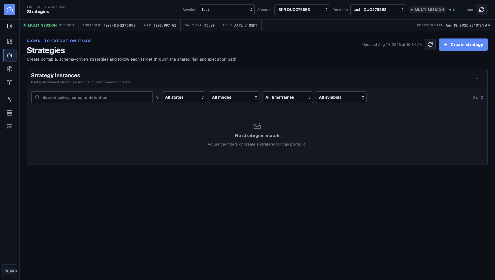
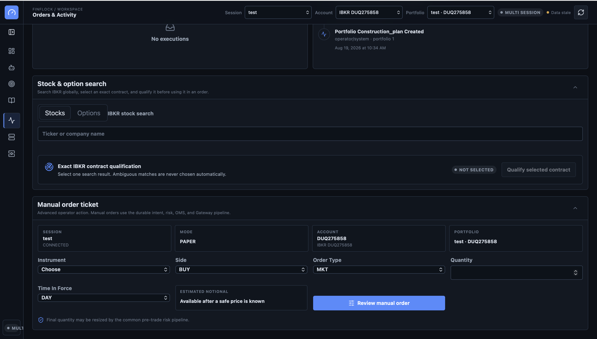

# Finflock Trading Engine

Finflock is a paper-first, event-driven trading platform for building strategies, monitoring broker-backed portfolios, and sending risk-checked orders to Interactive Brokers. It combines an operator-focused React workspace with durable Django workflows, real-time Kafka/Flink processing, portfolio accounting, and reconciliation.

> Paper and Live workflows use the same execution path. Live trading is disabled by default and remains gated by explicit configuration, readiness checks, reconciliation, kill switches, and pre-trade risk controls.

<p align="center">
  <a href="images/dashboard.png">
    
  </a>
</p>

## What it does

- Runs isolated IBKR Paper or Live sessions with encrypted, one-time-consumed credentials and managed noVNC access.
- Turns live market events into normalized prices, bars, indicators, and data-quality signals with Kafka and Flink.
- Supports portable, schema-driven strategies and follows each signal through targets, allocation, rebalancing, position sizing, and risk.
- Routes automatic and manual orders through one durable intent, OMS, broker-command, fill-accounting, and reconciliation pipeline.
- Gives operators one workspace for NAV, cash, exposure, holdings, P&L, orders, broker connectivity, streaming health, and audit activity.

## Architecture



Flink owns market-derived computation, Kafka transports events, and PostgreSQL owns financial workflow state. Strategy plugins produce deterministic decisions; they never submit broker orders directly. Only the private Gateway service owns the IBKR/TWS connection.

For the complete ownership and retry model, see [Architecture](docs/ARCHITECTURE.md) and [Order lifecycle](docs/ORDER_LIFECYCLE.md).

## Product tour

<table>
  <tr>
    <td width="50%">
      <a href="images/ibkr-sessions.png">
        
      </a>
      <br><strong>IBKR sessions</strong><br>
      Provision isolated Paper or Live sessions, select accounts, reconnect safely, and open the managed operator console.
    </td>
    <td width="50%">
      <a href="images/system-readiness.png">
        
      </a>
      <br><strong>Operations and safety</strong><br>
      Check Paper/Live readiness, IBKR connectivity, reconciliation, kill switches, streaming, and market-data health.
    </td>
  </tr>
  <tr>
    <td width="50%">
      <a href="images/portfolio.png">
        
      </a>
      <br><strong>Portfolio analytics</strong><br>
      Explore NAV and P&amp;L history, cash, gross and net exposure, concentration, holdings, and strategy allocation.
    </td>
    <td width="50%">
      <a href="images/strategies.png">
        
      </a>
      <br><strong>Strategy workspace</strong><br>
      Create schema-driven strategies and filter instances by lifecycle state, execution mode, timeframe, and symbol.
    </td>
  </tr>
</table>

### Manual orders

Search stocks and options globally, qualify an exact IBKR contract, and review an order before it joins the same durable risk and execution path as automated intents.

<p align="center">
  <a href="images/manual-order.png">
    
  </a>
</p>

## Run locally

### Prerequisites

- Docker with Compose v2
- PowerShell for the included end-to-end smoke scripts

```bash
cp .env.example .env
docker compose up --build -d
docker compose exec backend python manage.py bootstrap_recommendation_system --skip-external
docker compose ps
```

Open the Frontend at <http://localhost:5173>. Backend liveness is available at <http://localhost:8000/healthz> and automatic-execution readiness at <http://localhost:8000/api/v1/execution/readiness/>.

The local Compose stack starts PostgreSQL, Redis, Kafka, Flink, Backend, and Frontend. It intentionally does not start an IBKR Gateway; broker operations require a configured managed session. See [Local development](docs/LOCAL_DEVELOPMENT.md) and [IBKR setup](docs/IBKR_SETUP.md).

## Repository map

| Path | Purpose |
| --- | --- |
| `Frontend/` | React, TypeScript, Vite, TanStack Query, Zustand, and Nginx |
| `Backend/` | Django API, Celery workers, strategy/research workflows, risk, OMS, accounting, and reconciliation |
| `IB_gateway/` | Private per-session IBKR Gateway service and the sole `ib_async`/TWS boundary |
| `streaming/` | Kafka schemas, topic setup, and PyFlink market-processing jobs |
| `Trading_Engine_Stock_Strategy_Universe_JSON/` | Versioned stock/strategy universe and compatibility rules |
| `docs/` | Architecture, deployment, operations, workflow, and safety documentation |

## Verify

```bash
cd Backend && pytest
cd ../Frontend && npm ci && npm test && npm run test:production-build
cd .. && python -m pytest streaming/flink/tests
docker compose config --quiet
```

For deployment configuration, routes, networking, and Gateway image requirements, see [QFS deployment](docs/QFS_DEPLOYMENT.md).
